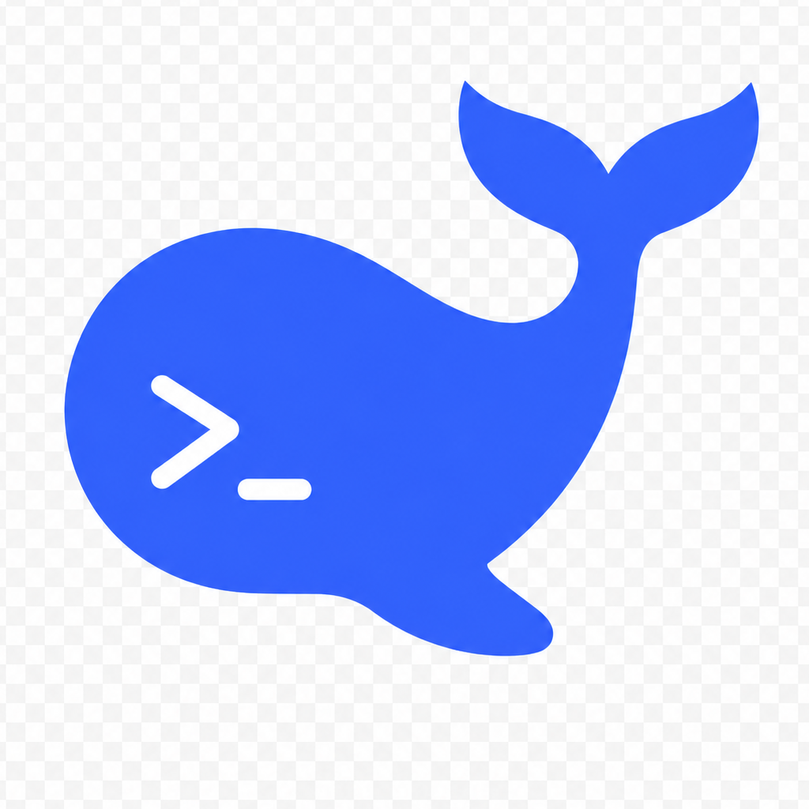

<p align="center">
  
</p>

<h1 align="center">deepcodex</h1>

<p align="center">
  Codex Desktop + DeepSeek route patch
</p>

把 Codex Desktop 接到 DeepSeek 上的轻量补丁。

Lightweight macOS patch that routes Codex Desktop through DeepSeek while keeping the familiar Codex workflow.

> **Platform**
>  
> 当前仅支持 **macOS**。  
> **Windows 版本稍后提供。**
>
> Currently **macOS only**.  
> **Windows support will come later.**

> **License / 使用限制**
>  
> 本项目当前仅允许个人学习、研究和非商业使用。  
> **禁止商用、转售、托管服务、付费集成或任何形式的商业化再分发。**
>
> Personal, research, and non-commercial use only.  
> **Commercial use, resale, hosted services, paid integrations, and commercial redistribution are not allowed.**

它不重做 IDE，也不重写一整套插件生态。  
它只做几件关键的事：

- 保留 Codex Desktop 原本的使用手感
- 增加 DeepSeek API key 登录入口
- 用本地 translator 把 Codex 请求转给 DeepSeek
- 给 deepcodex 保留一套独立工作区 / 状态目录

一句话：

> **deepcodex = Codex Desktop + DeepSeek 路由补丁**

---

## Quick Start

Prerequisite: install **Codex Desktop** first. deepcodex will automatically locate the local Codex Desktop app and attach to it.

```bash
./scripts/install-deepcodex-app.sh
```

然后：

1. 打开 `/Applications/deepcodex.app`
2. 输入 DeepSeek API key
3. 开始使用

Then:

1. Open `/Applications/deepcodex.app`
2. Enter your DeepSeek API key
3. Start using DeepCodex

The first-run setup UI follows your macOS/browser language: Simplified Chinese for `zh*` locales, English otherwise.

---

## 这版能做什么

- 以独立 app 形式启动：`/Applications/deepcodex.app`
- 首次输入 DeepSeek API key，之后直接进入 deepcodex
- 把 Codex 的模型请求转到 DeepSeek
- 保留 Codex 适合写代码、改项目、做日常开发的交互方式
- 使用独立工作区 / 独立状态目录，避免和原版 Codex 完全混在一起

对大多数文本、代码、项目修改类任务来说，这版已经能稳定工作。

---

## 这版不是什么

deepcodex 现在**不是**：

- 一个完全独立于 Codex 宿主生态的新产品
- 一套自己重做的插件平台
- 一个保证支持所有 OpenAI 宿主高级能力的替代品

尤其是下面这些能力，当前**不承诺**在 DeepSeek 路线可用：

- `computer-use`
- Gmail / Google Drive / Slack 这类 connector / app tools
- 依赖 OpenAI 宿主授权、工具下发或高级路由的插件能力

如果某项能力在原版 Codex + OpenAI 路线可用，但在 deepcodex + DeepSeek 路线不可用，优先把它视为**当前产品边界**，不是普通使用错误。

---

## 产品定位

这版的核心其实只有三件事：

1. **DeepSeek key**
2. **本地 translator / 路由**
3. **独立工作区与状态**

插件安装策略也已经收口：

- 插件仍然装在 **Codex 公共宿主** 里
- deepcodex **直接复用 Codex 已安装插件**
- 不再自己再造一套插件安装世界

也就是说，日常心智可以很简单：

- 在 Codex 里装插件
- 在 deepcodex 里继续用
- deepcodex 负责模型路由，不负责重写整套插件体系

---

## 工作方式

```text
deepcodex.app
  -> local launcher
  -> local translator (:8282)
  -> DeepSeek API
```

运行时大致分三层：

- **deepcodex.app**
  - 独立图标
  - 独立首次 setup
  - 独立启动入口

- **translator**
  - 把 Codex 的请求转成 DeepSeek 能接的格式
  - 处理路由、兼容、基础工具规则

- **Codex Desktop 宿主**
  - 仍然依赖用户本机已有的 Codex Desktop
  - 插件安装生态优先沿用 Codex

---

## 安装

```bash
./scripts/install-deepcodex-app.sh
```

安装完成后会得到：

```text
/Applications/deepcodex.app
```

然后直接从“应用程序”里双击 `deepcodex` 即可。

---

## 首次启动

首次启动流程是：

1. 打开 `deepcodex`
2. 输入 DeepSeek API key
3. 测试连接
4. 自动进入主界面

setup 会尽量保持极简，不要求你手动开终端，也不要求你额外起代理层。

---

## 使用规则

### 双开 Codex 和 deepcodex

deepcodex 是独立 app，但内部仍复用本机 Codex Desktop 的运行核心。  
因此在 macOS 上，**推荐先打开原版 Codex，再打开 deepcodex**。

推荐顺序：

1. 打开原版 `Codex`
2. 打开 `deepcodex`

如果你已经先打开了 `deepcodex`，再想打开原版 `Codex`，请用：

```bash
open -n -a "Codex"
```

原因是 macOS 可能会把正在运行的 Codex 核心进程视为“Codex 已打开”，普通双击原版 Codex 时只聚焦已有实例，而不是再开一个原版实例。

不要手动修改 `/Applications/Codex.app`。deepcodex 是补丁入口，不会改写官方 Codex app。

---

## 关键目录

- `/Applications/deepcodex.app`
  - 已安装 app

- `translator/adaptive-server.mjs`
  - translator 主入口

- `scripts/start-deepcodex.sh`
  - 启动链主脚本

- `~/Library/Application Support/deepcodex/`
  - deepcodex 运行时状态目录

---

## 模型映射

| Codex slug | DeepSeek model |
|---|---|
| `gpt-5.5` | `deepseek-v4-pro` |
| `gpt-5.4` | `deepseek-v4-pro` |
| `gpt-5.4-mini` | `deepseek-v4-flash` |

---

## 已知边界

### 1. 这是补丁，不是全替身

deepcodex 主要解决的是：

- 模型入口
- 请求翻译
- 独立工作区

不是把 Codex Desktop 全部重新实现一遍。

### 2. 某些高级工具能力依赖 OpenAI 宿主

像下面这类能力，当前仍可能依赖 OpenAI / Codex 宿主授权与工具下发：

- connector 型插件
- app tools
- `computer-use`
- 浏览器 / 桌面自动化相关高级能力

### 3. 插件安装与插件可调用，不是同一回事

插件“已经装好”只说明：

- 插件包存在
- 宿主能看见它

不等于当前 DeepSeek 会话里一定已经拿到了对应的 callable tools。

---

## 适合谁

如果你想要的是：

- 保留 Codex Desktop 的主要体验
- 用 DeepSeek 跑日常代码与项目任务
- 不想为了改模型入口就再学一套新工具

那 deepcodex 就是对的。

如果你要的是：

- 100% 复刻 OpenAI 宿主的所有高级工具能力
- 所有 connector / hosted tools / desktop tools 全量等价可用

那这版还不是那个目标。

---

## 当前结论

这版最准确的理解方式是：

> **一个能把 Codex Desktop 稳定接到 DeepSeek 上的实用补丁。**

它已经足够适合真正开始用，  
也足够诚实，不会把还没彻底打通的能力包装成“全都支持”。
