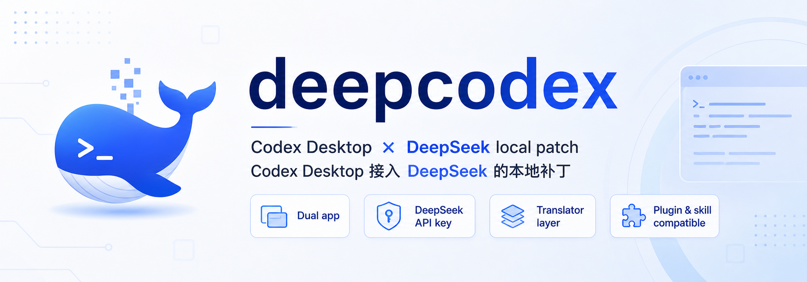

  

  <strong>macOS available</strong> · <strong>Windows beta</strong> · <strong>DeepSeek API key</strong> · <strong>Non-commercial use only</strong>

  <a href="README.md">中文 README</a>

---

## In One Sentence

**deepcodex is not a new DeepSeek IDE. It is a local patch that gives the official Codex Desktop a separate, dual-runnable DeepSeek model route.**

It does not rewrite Codex Desktop, and it does not try to build a separate plugin ecosystem. It keeps the Codex Desktop runtime, UI, workflows, project experience, and as much of the plugin / skill ecosystem as possible, while using a local translator to route model traffic to DeepSeek.

Highlights:

- **Dual app setup**: run official Codex and deepcodex side by side
- **Independent app entry and icon**: use DeepCodex without overwriting the official Codex app
- **Simple first setup**: enter a DeepSeek API key once, then launch normally
- **Compatibility layer**: Responses ↔ Chat translation, tool calls, DSML, compaction, `web_search`, and `web_fetch`
- **Plugin / skill compatibility where possible**: reuse Codex's shared plugin, skill, MCP, and local tool ecosystem
- **Codex workflow preserved**: keep the familiar project, tool, and development flow

Contact / updates: Douyin or WeChat Channels **@娄老师说的对**

---

## Download

Latest release:

[deepcodex v0.1.0-preview](https://github.com/louchi1984-coder/deepcodex/releases/tag/v0.1.0-preview)

| Platform | Status | Download |
| --- | --- | --- |
| macOS | Available | `deepcodex-macos-2026.05.16.dmg` |
| Windows | beta / preview | `deepcodex-windows-v0.1.5-preview.zip` |

Users on older builds are encouraged to update. Recent builds include fixes for context compaction, DSML pseudo tool calls, `web_search` / `web_fetch` tool result handling, fake tool narration guards, and several DeepSeek compatibility issues.

---

## Quick Start

Requirement: install the official **Codex Desktop** first.

deepcodex does not bundle official Codex Desktop and does not modify the official Codex app itself.

### macOS

1. Download `deepcodex-macos-2026.05.16.dmg`
2. Open the DMG and drag `DeepCodex.app` into `Applications`
3. Open `DeepCodex`
4. Enter your DeepSeek API key; once the connection test passes, it is saved automatically

### Windows beta

1. Download `deepcodex-windows-v0.1.5-preview.zip`
2. Unzip it
3. Double-click `install-windows.bat`
4. Launch `DeepCodex` from the desktop shortcut or Start Menu
5. Enter your DeepSeek API key

The first setup is intentionally minimal: no manual terminal setup, and no extra service the user has to start by hand.

---

## What Works Today

- Independent app entry and icon: `DeepCodex.app` / `DeepCodex.exe`
- Side-by-side use with official Codex
- First-run DeepSeek API key setup
- Local translator: Responses ↔ Chat protocol adaptation
- DeepSeek tool-call compatibility for function / custom / namespace tools
- DSML pseudo tool-call handling so pseudo tool markup is not exposed directly to users
- Local fallback tools for `web_search` and `web_fetch`
- Context compaction continuation fixes
- Shared Codex plugin / skill / MCP configuration where possible

For most text, code, and project-editing workflows, the macOS build is already usable. The Windows build is currently beta / preview.

---

## Current Boundaries

deepcodex is currently **not**:

- A fully independent product separate from the Codex host ecosystem
- A rewritten plugin platform
- A complete replacement for every OpenAI-hosted advanced capability

The following capabilities are **not guaranteed** on the DeepSeek route:

- `computer-use`
- Gmail / Google Drive / Slack connector app tools
- Plugin features that rely on OpenAI account authorization, hosted tool injection, or advanced OpenAI-side routing

If something works in official Codex with the OpenAI route but not in deepcodex with the DeepSeek route, treat it as a current product boundary first, not a normal user setup error.

---

## License / Use Restriction

This project is for personal, research, and non-commercial use only.

Commercial use, resale, hosted services, paid integrations, and commercial redistribution are not allowed.

